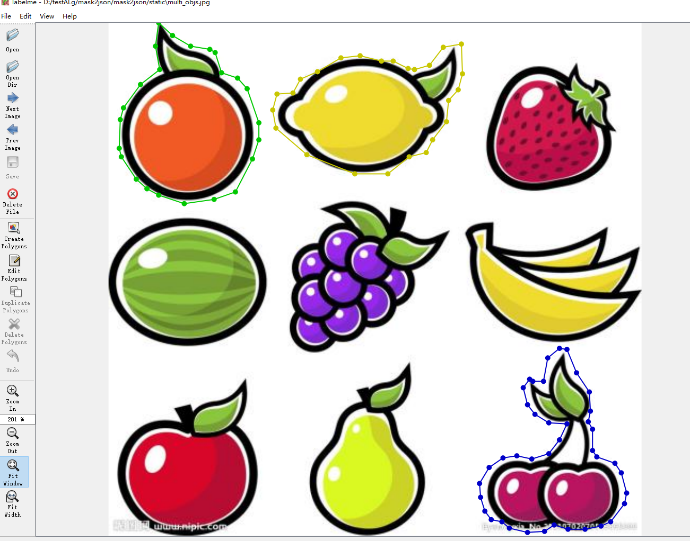
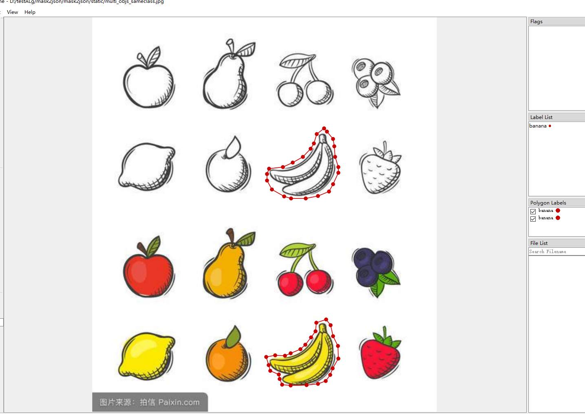
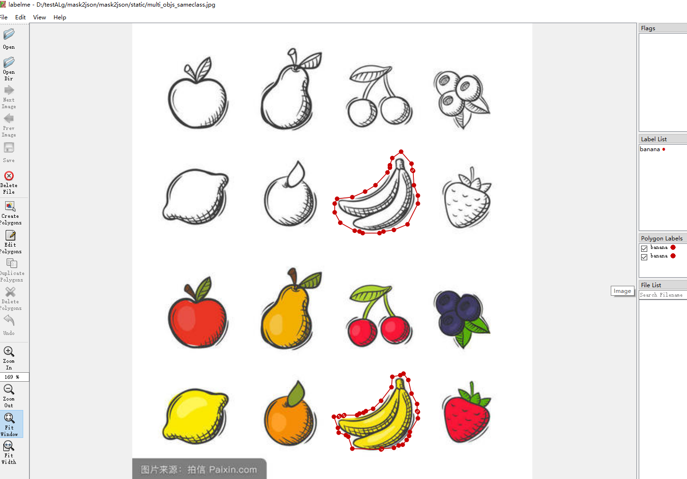
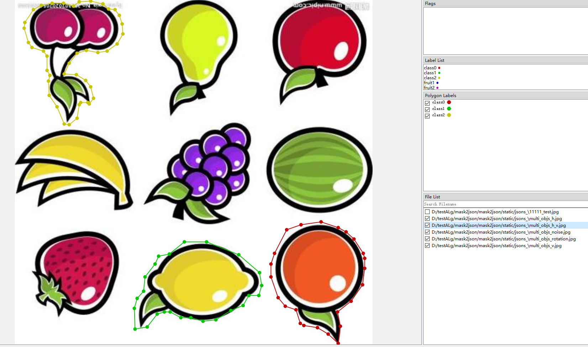
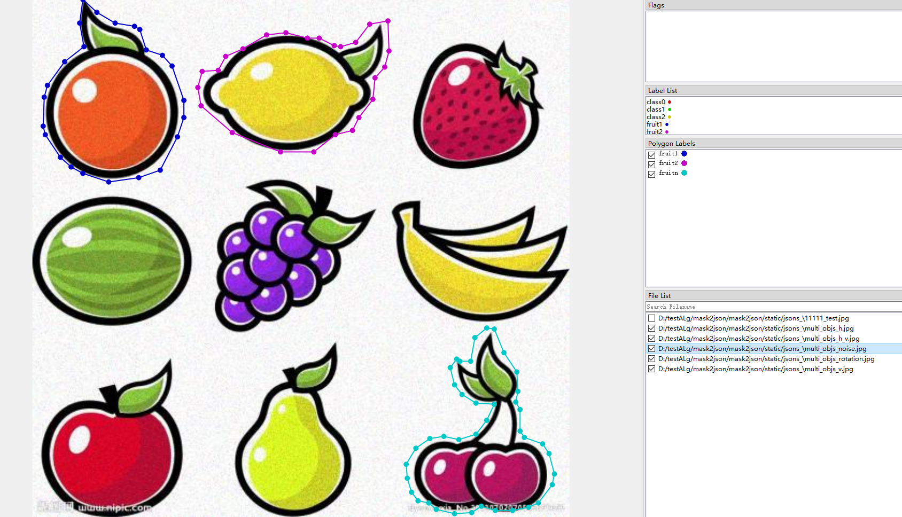
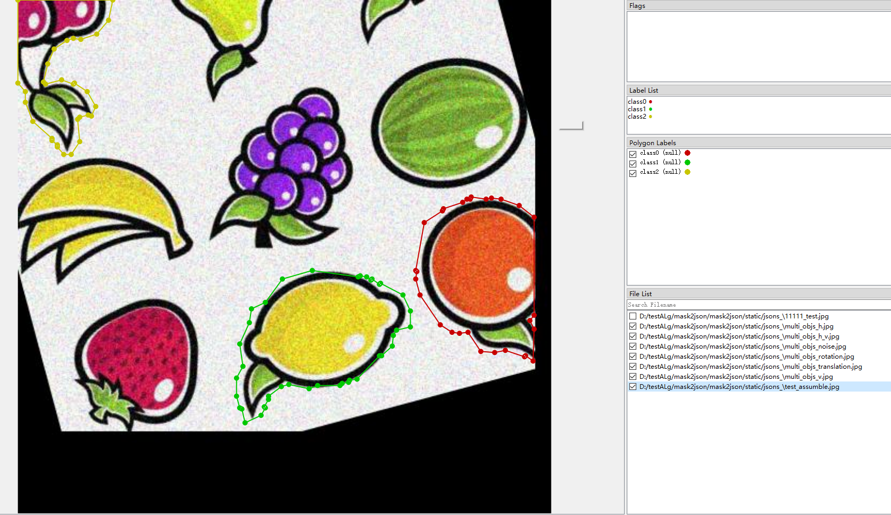
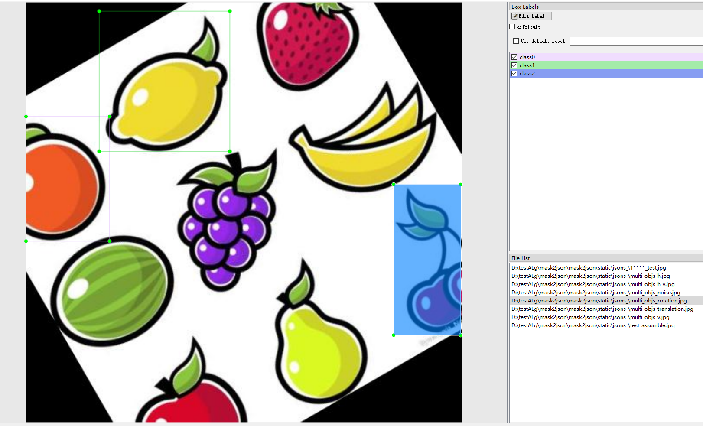

<!--
 * @lanhuage: markdown
 * @Descripttion: 
 * @version: 
 * @Author: xiaoshuyui
 * @Date: 2020-06-09 16:23:03
 * @LastEditors: xiaoshuyui
 * @LastEditTime: 2020-08-21 08:23:03
--> 

# mask2json

 a small tool for image augmentation, including mask files to json/xml files , image augmentation(flip,rotation,noise,...) and so on

 ## HOW TO USE

 This script is used to convert mask-labels to json files for [labelme](https://github.com/wkentaro/labelme).

 FIRST:

    pip install -r requestments.txt [-i https://pypi.tuna.tsinghua.edu.cn/simple/] 

AND THEN:

 Json files to masks can be found on this [site](https://blog.csdn.net/gaoyi135/article/details/103870646). Sometimes there will be an ERROR,should add this [file](./mask2json/draw.py) in labelme path ('../anaconda/Lib/site-packages/labelme/utils ' my path) and add some codes in \_\_init__.py:

    from .draw import label_colormap
    from .draw import _validate_colormap
    from .draw import label2rgb
    from .draw import draw_label
    from .draw import draw_instances 

Here shows an example using this script.

origin image

mask image

manually_labeled image

auto_labeled image

Also ,for [labelimg](https://github.com/tzutalin/labelImg),a small tool to convert results(yolo) to [xml-files](./mask2json_utils/img2xml).

### (1) for labelme mask files

the test script can be found [here](./test_scripts/test_mask2json.py)

    from mask2json_utils import getMultiShapes
    getMultiShapes.getMultiShapes(param1,param2,param3,param4)

param1:path which saves the origin imgs

param2:path which saves the mask imgs (file names should match the origin imgs)

param3:converted json files save path

param4:can be blank (better don't), a yaml file path which saves the class information

### (2) for labelimg mask files

the test script can be found [here](./test_scripts/test_multiObjs2Xml.py)

    from mask2json_utils.getMultiShapes import getMultiObjs_voc as gvoc
    gvoc(param1,param2,param3)

param1:path which saves the origin imgs

param2:path which saves the mask imgs (file names should match the origin imgs)

param3:converted xml files save path

### (3) for json files  to mask files

the test script can be found [here](./test_scripts/json2mask.py)

    from mask2json_utils.convert import processor
    processor(param1,param2)

param1:json file or folder

param2:can be blank,encoding type, default 'utf-8'

### (4) for json files to xml files

the test script can be found [here](./test_scripts/test_json2xml.py)

    from mask2json_utils.json2xml import j2xConvert
    j2xConvert(path-of-your-jsonfile)

### (5) image augmentation

the test script can be found [here](./test_scripts/test_imgAug.py)

    from mask2json_utils.imgAug import imgFlip,imgNoise,imgRotation,imgTranslation,aug_labelme
    
    imgFlip(imgPath, labelPath)
    imgNoise(imgPath,labelPath)
    imgRotation(imgPath,labelPath)
    imgTranslation(imgPath,labelPath)

details see [Here](#2020.8.17)

## AILERNATIVE

you can try:

    pip install -U convertmask

and 

    pip uninstall convertmask

to delete convertmask.

it is a test release. : )

### version 0.3.1 (2020.8.20 , pre-release)

#### 1.try :

    convertmask -h | --help

to read the guide.

#### 2.try:

    convertmask -v | --version

to show the current version

#### 3.try:

    convert m2j 

to test mask to json function(should type in some file path)

#### 4.try:

    convert m2x 

to test mask to xml function(should type in some file path)

#### 5.try:

    convert j2m 

to test json to mask function(should type in some file path)

#### 6.try:

    convert j2x 

to test json to xml function(should type in some file path)

#### 7.try:

    convert aug 

to test image augmentation function(should type in some file path)

##  SHORTCOMING

1.~~objects connected to each other is not supported yet.~~

this may happen if you labelling multiple-object-images with only 2 labels .Or some objects are of the same type and are connected to each other(eg. a bunch of grapes,it is hard to split one to the other).

# CHANGE LOGS

## 2020.6.12

### 1.support multiple objects mask to json

try [test.py](./test.py) !

#### 1.1 multiple objects in different classes

manually_labeled image

auto_labeled image

#### 1.2 multiple objects in same classes

manually_labeled image

auto_labeled image

## 2020.7.10

### 1. a lot of things to do ,such as many warnings related to labelme.

## 2020.7.13

### 1. convert multi objects to xml files supported (untested)

## 2020.7.14

### 1.bugfix , test multi objects to xml files, pretty xmls

eg:

## 2020.7.17

### 1. is going to support image augmentation  !!

## 2020.8.14

### 1. add image augmentation  (image flip) test. see [test_imgAug.py](./test_scripts/test_imgAug.py) !

## 2020.8.17

### 1. bug fix.

### 2. support image augmentation methods: noise,flip,rotation. try [test_imgAug.py](./test_scripts/test_imgAug.py) !

here are some examples:

### flip

### noise

### rotation

## 2020.8.19

### 1. image translation supported.

combination of every augmentation method.

### 2. besides, a simple way convert json file(labelme) to xml file(labelImg) is provided. see [here](./test_scripts/test_json2xml.py)

# what to do next

## 1. support multiple files image augmentation

## 2. support image augmentation without a label/json file

## 3. support image augmentation with a labeled file (just support json file right now)

## 4. image augmentation supports custom parameters (auto augmented right now)

## 5. do something more interesting

